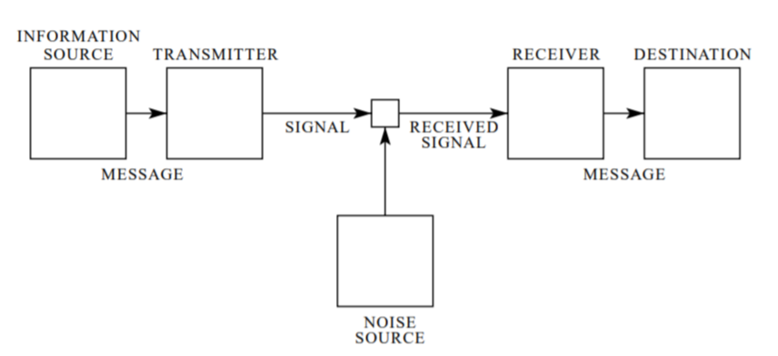

# Internet Protocols

In today's world, we are searching on Google, making friends on Facebook, sharing photos/videos on Instagram/Snapchat, Chating with Friends on Whatsapp, Watching video/Livestream on youtube, etc. Ever wonder whats happen, when you see a live stream? How somebody could send a live stream video to thousands of Fans immediately.

This works when all are connected to some network, mobile data or WiFi. That's where networking and Internet Protocols work along with other layers of Protocols. It was not always that easy to see live stream or video on the Internet. It got evolved to what it is today.

All of the communication in Digital Era of ours started with one landmark research paper, ***A Mathematical Theory of Communication*** by **Claude Elwood Shannon** in 1948. This one paper started the field of *Information Theory*. 

**Information theory** studies the transmission, processing, extraction, and utilization of information. Information is your text/photo/audio/video, Shannon defined Information in more generic nature that we will see later. One of the applications of Information theory covers Information (e.g. text) that needs to be transmitted over an unreliable medium, e.g. Wifi, Mobile Network, LAN, etc., then quantified again to the same information that was transmitted. One another application of Information theory covers Information storage on an unreliable medium like Disk, Optical drive, etc. and retrieval of the same information in a reliable manner. 

Shannon defined information as a resolution of uncertainty, giving it a quantifiable value which represents a stochastic approach to language. In simple terms, sending and retrieving of Information over uncertain medium and getting the same Information. Same Information that can be quantified or verified. Shannon defined his Communication system as followed,

Shannon proposed a mathematical theory of digital communication in his paper *A Mathematical Theory of Communication*. Shannon mathematically proves the possibility of Digital systems in 1948. That's why he sometimes called as *The Father of The Information Age*. Because of Shannon, we have all the modern communication devices working on digital systems.

There is some criticism of Shannon Model of Communication,
- It didn't consider the semantics of Information passed
- It mimics only one-to-one communication not group or mass communication
- Reciever plays a passive role in communication. Sender actively passing the information to the passive receiver. That don't happen in a real-world scenario.
- It considers the continuous system as an extension to discrete 

Despite its criticism, Digital Era as we know it right now started with Shannon paper. 

## References
A Mathematical Theory of Communication By C. E. SHANNON [http://math.harvard.edu/~ctm/home/text/others/shannon/entropy/entropy.pdf](http://math.harvard.edu/~ctm/home/text/others/shannon/entropy/entropy.pdf)
<!--stackedit_data:
eyJwcm9wZXJ0aWVzIjoiZXh0ZW5zaW9uczpcbiAgcHJlc2V0Oi
BnZm1cbiIsImhpc3RvcnkiOls3NTcyMjcwNDIsLTE3NDQ5NDIy
MjYsNTIwMjY1NDUzLDE4MzQ1NDMxODIsLTEzMTUzNjU1ODEsOD
E5MDcwNjE0LC0xMDE2NDU3NzUxLDE5NzA0NTkxOCw4NDExNTcw
OTcsMTU5OTk5MjQwNiw4ODYzNDQ1NjksOTMxNjgzMTAzLC05NT
UzNjkyNjksNzA4NDM2ODk3LDYzNzIzNjQ2NywtNjk4NDg0ODMy
LC0xODgwOTA2NTQ0LDEyNTk0MTMxMzcsMTA4NTIwNTUxNiwtMT
I1MjY2NjYyNF19
-->